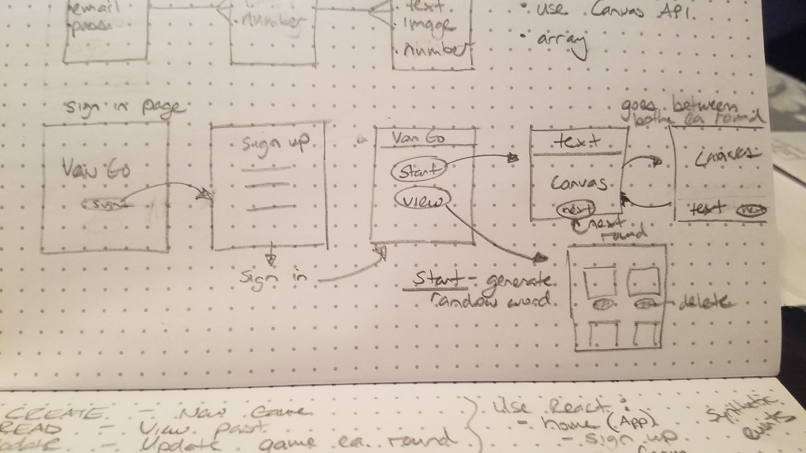

## Welcome to V.A.N.Go!
- The Drawing App for All Ages

# Snapshot of App

## Description
- User can sign up and sign in using email and password
- Once signed in, they can change password and sign out
- As well as Create and View all drawings
- On the View Drawings page, users can delete and update their personal created drawings (other user drawings can not be manipulated)

## Preparation
1. Fork and Clone this repository.
2. `git checkout` to a new branch
3. Install dependencies with `npm install`
4. Install React CanvasDraw with `npm install react-canvas-draw --save`
5. Run `npm run server` in terminal to test server

## Repo URL's
- Front-end: https://github.com/clark-rob/vango-client
- Back-end: https://github.com/clark-rob/vango-server
-
## Deployed Site URL's
- Front-end: https://clark-rob.github.io/vango-client/
- Back-end: https://vango-server.herokuapp.com/

## Technologies
- React JS was used to create the entire front end, Single Page App.
- React-canvas-draw: https://github.com/embiem/react-canvas-draw
-     - used to create each canvas drawing within the application

    ```javascript
    import CanvasDraw from "react-dom"
    ```
- Express/ Node.js was used with MongoDB on the backend

## Idea Behind the App
- Based off a party game called 'Scrawl,' it's pictionary meets telephone.
- BUT, Version 1 is a basic drawing application that saves and showcases
a group of individuals creations.

## Future Fixes
- stop the error about 'drawImage'
- clear 'creation form' after submit
- CSS
- Proceed with creating the game version
- create images instead of an array of points, upload to Amazon Web Services
- upload Wireframe :/

## User Stories
- As a user, I want to be able to have authorized access so that I can play and
view my current and past games
- As a user, I want to be able to generate a random word(s) by clicking a button
so that I can create a new game
- As a user, I want to be able to draw on my screen on mouse click so that once
my mouse is not clicked, the drawing stops
- As a user, I want to be able to update my game after each round is complete so
that I can continue playing another time
- As a user, I want to be able to save past games so that I can view them at
another time
- As a user, I want to be able to save past games so that I can delete them at
another time


# Wireframe


## Resources
  This app was built using the assistance of Google search engine.
  It helped me find sites such as:
    [https://developer.mozilla.org/en-US/]
    [https://www.w3schools.com/]
    [https://stackoverflow.com/]

  Majority of all my questions, led me to past training notes and
  practices.

  Other problems were assisted by fellow colleagues in GA WDI PVD-04
    -Thank you all for the help.
